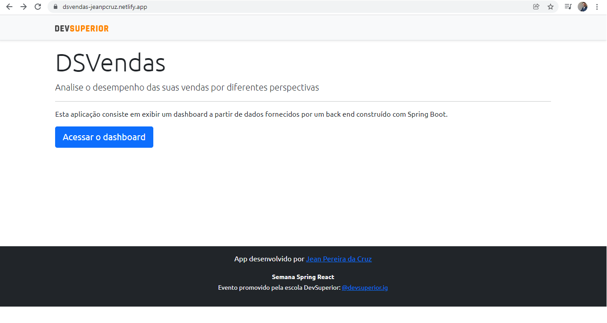
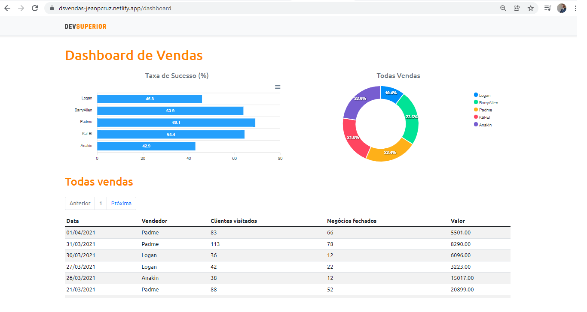
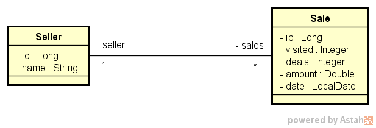

# Sobre o Projeto

Acesse-o aqui: 
https://dsvendas-jeanpcruz.netlify.app/

Essa aplicação se trata de um Dashboard de Vendas que nos permite visualizar vendas detalhadas em diferentes gráficos, e também através de páginas com controle de paginação. Os dados são providos pelo back-end desenvolvido com a utilização do framework Spring boot.
<br><br>
Essa aplicação foi desenvolvida durante a 5º edição do evento online promovido pela <a href="https://devsuperior.com.br/">DevSuperior</a>.

# Pagina Home 



# Dashboard



# Modelo conceitual



# Tecnologias utilizadas 

## Back end

<ul>
<li>Java</li>
<li>Spring Boot</li>
<li>JPA / Hibernate</li>
<li>Maven</li>
</ul>

## Front end

<ul>
<li>HTML / CSS / Typescript</li>
<li>Bootstrap</li>
<li>ReactJS</li>
<li>Biblioteca Apex Charts</li>
</ul>

## Implantação 

<ul>
<li>Back end: Heroku</li>
<li>Front end: Netlify</li>
<li>Banco de Dados: PostgreSQL</li>
</ul>

# Como executar o Projeto

## Back end
Pré requisitos: Java 11

```bash
# clonar repositório
git clone https://github.com/jeanpereiradacruz/project-sds3.git

# entrar na pasta do projeto back end
cd backend

# executar o projeto
./mvnw spring-boot:run
```

## Front end web
Pré-requisitos: npm / yarn

```bash
# clonar repositório
git clone https://github.com/jeanpereiradacruz/project-sds3.git

# entrar na pasta do projeto front end web
cd frontend

# instalar dependências
yarn install ou npm install

# executar o projeto
yarn start ou npm start
```

# Autor
Jean Pereira da Cruz - <a href="https://www.linkedin.com/in/jean-pereira-cruz/">Linkedin</a>


